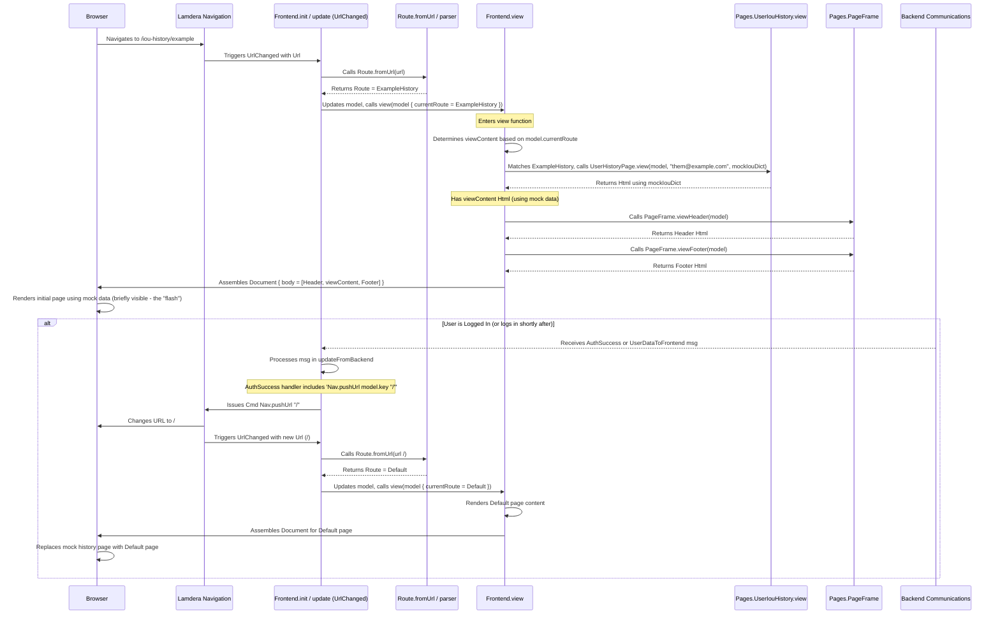

This diagram shows a plausible *actual* flow explaining the flash:

1.  The URL `/iou-history/example` is parsed, and the view initially renders using `mockIouDict`.
2.  This mock view is briefly visible in the browser.
3.  If the user is logged in, a message like `AuthSuccess` arrives from the backend.
4.  The `updateFromBackend` function handles this message.
5.  Crucially, the handler for `AuthSuccess` issues a `Nav.pushUrl model.key "/"` command.
6.  Lamdera Navigation changes the browser URL to `/`.
7.  This triggers `UrlChanged` again, parsing the route as `Default`.
8.  The `Frontend.view` function now renders the `Default` page, replacing the previously flashed `ExampleHistory` content.

This sequence explains why the mock data appears briefly and then disappears when logged in – the application automatically navigates the user to the home page after confirming authentication. 